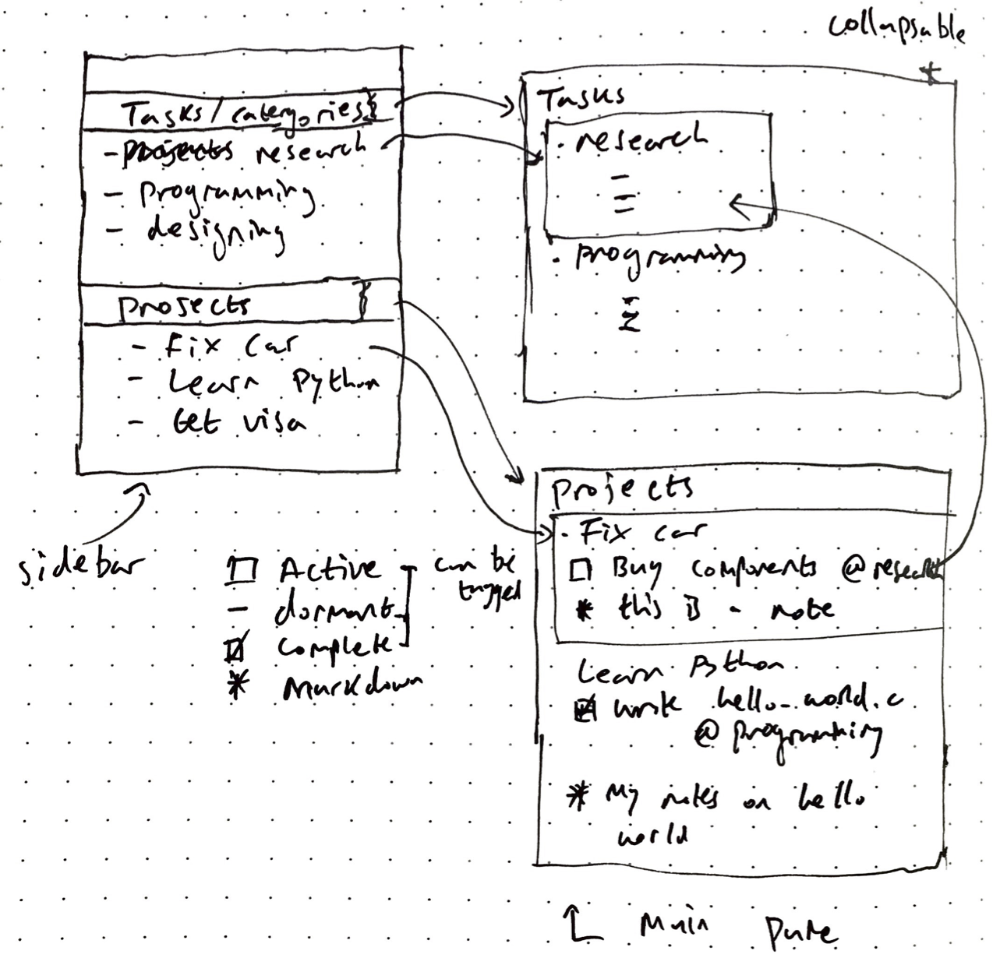

# The Life Planner

## What

The Life Planner lets you plan your projects with flexibility and ease. By allowing markdown input with inline tasks, /The Life Planner/ gives you the the ability to plan your projects and implement those plans in a single app. The tasks and your plan sit side by side, complementing and providing context to one another. 

## Why

For a long time I've been trying to integrate my project plans and the todo list tasks associated with them. The problem is that no product exists that actually allows for this. The Life Planner puts your tasks right where they belong, with your projects rather than just in a random list.

## Coming soon

* Truly customisable recurring tasks — e.g. every third Monday of the month, or 2 days from now then every day hence
* Waiting for to show what is pending in a project
* A review as a standalone and integrated feature — in the current tasks view tasks over 3 days old are highlighted, tasks that are really old might prompt a message e.g. ’This task is over 1 month old’ 

